# Enterprise Approval Engine

[](README.md)
[](ES/README.md)

An **IssueOps-powered** GitHub Action for enterprise-grade approval workflows. Approvals happen through GitHub Issues - reviewers comment `approve` or `deny`, and the action handles the rest: policy validation, tag creation, and deployment triggers.

> **What is IssueOps?** IssueOps uses GitHub Issues as the interface for operations. Instead of approving through a separate UI or CLI, approvers interact directly with GitHub Issues - commenting, closing sub-issues, or reacting. This provides a transparent audit trail, familiar UX, and native GitHub notifications.

## IssueOps in Action

<table>
<tr>
<td width="50%">

**Issues list showing approval pipeline:**


</td>
<td width="50%">

**Approval issue with sub-issues and pipeline visualization:**


</td>
</tr>
</table>

📋 **See it live:** [Example approval issue](https://github.com/jamengual/enterprise-approval-engine/issues/7)

## Features

- **Flexible Approval Logic**: Support for both AND (all must approve) and threshold (X of N) logic within groups
- **OR Logic Between Groups**: Multiple approval paths - any one group meeting requirements approves the request
- **Mixed Approvers**: Combine individual users and GitHub teams in the same group
- **Progressive Deployment Pipelines**: Single-issue tracking through multiple environments (dev → qa → stage → prod)
- **Pipeline Visualization**: Color-coded Mermaid flowchart diagrams showing deployment progress
- **Sub-Issue Approvals**: Create dedicated approval sub-issues for each stage - close to approve
- **Enhanced Comments UX**: Emoji reactions on approval comments, Quick Actions section with command reference
- **Issue Close Protection**: Prevent unauthorized users from closing approval issues (auto-reopen)
- **Hybrid Approval Modes**: Mix comment-based and sub-issue approvals per workflow or stage
- **PR and Commit Tracking**: Automatically list PRs and commits in deployment issues for release management
- **Semver Tag Creation**: Automatically create git tags upon approval
- **Policy-Based Configuration**: Define reusable approval policies in YAML
- **Issue-Based Workflow**: Transparent audit trail through GitHub issues
- **Jira Integration**: Extract issue keys from commits, display in approval issues, update Fix Versions
- **Deployment Tracking**: Create GitHub deployments for visibility in deployment dashboard
- **External Config**: Centralize approval policies in a shared repository
- **Rate Limit Handling**: Automatic retry with exponential backoff for GitHub API rate limits
- **GitHub Enterprise Server**: Full support for GHES environments
- **No External Dependencies**: Pure GitHub Actions, no external services required

## Table of Contents

- [IssueOps in Action](#issueops-in-action)
- [Quick Start](#quick-start)
- [Action Reference](#action-reference)
  - [Actions](#actions)
  - [Inputs](#inputs)
  - [Outputs](#outputs)
- [Configuration Reference](#configuration-reference)
  - [Policies](#policies)
  - [Workflows](#workflows)
  - [Tagging](#tagging-configuration)
  - [Custom Templates](#custom-issue-templates)
  - [Defaults](#defaults)
  - [Semver](#semver)
- [Complete Configuration Reference](#complete-configuration-reference)
- [Feature Details](#feature-details)
  - [Approval Keywords](#approval-keywords)
  - [Team Support](#team-support)
  - [Progressive Deployment Pipelines](#progressive-deployment-pipelines)
  - [Release Candidate Strategies](#release-candidate-strategies)
  - [Jira Integration](#jira-integration)
  - [Deployment Tracking](#deployment-tracking)
  - [External Config Repository](#external-config-repository)
  - [Blocking Approvals](#blocking-approvals)
  - [Tag Deletion](#tag-deletion-on-issue-close)
- [Complete Examples](#complete-examples)
- [Schema Validation](#schema-validation)
- [GitHub Enterprise Server](#github-enterprise-server)

## How It Works

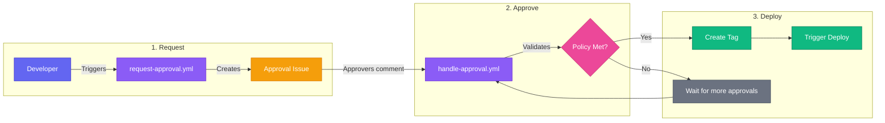

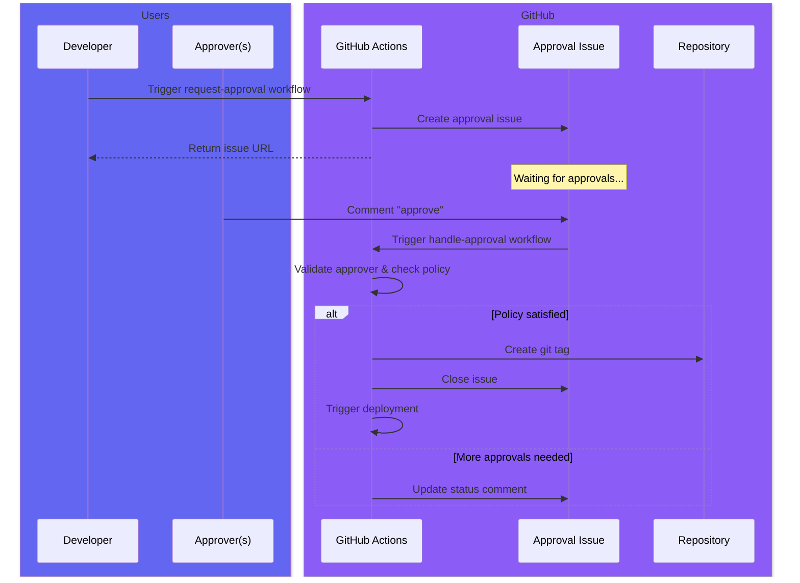

## Quick Start

### 1. Create Configuration

Create `.github/approvals.yml` in your repository:

```yaml
version: 1

policies:
  dev-team:
    approvers: [alice, bob, charlie]
    min_approvals: 2

  platform-team:
    approvers: [team:platform-engineers]
    require_all: true

workflows:
  production-deploy:
    require:
      # OR logic: either path satisfies approval
      - policy: dev-team        # 2 of 3 developers
      - policy: platform-team   # ALL platform engineers
    on_approved:
      create_tag: true
      close_issue: true
```

### 2. Request Approval Workflow

Create `.github/workflows/request-approval.yml`:

```yaml
name: Request Deployment Approval

on:
  workflow_dispatch:
    inputs:
      version:
        description: 'Version to deploy (e.g., v1.2.3)'
        required: true
        type: string

jobs:
  request:
    runs-on: ubuntu-latest
    steps:
      - uses: actions/checkout@v4
      - uses: jamengual/enterprise-approval-engine@v1
        id: approval
        with:
          action: request
          workflow: production-deploy
          version: ${{ inputs.version }}
          token: ${{ secrets.GITHUB_TOKEN }}

      - name: Output Results
        run: |
          echo "Issue: ${{ steps.approval.outputs.issue_url }}"
          echo "Status: ${{ steps.approval.outputs.status }}"
```

### 3. Handle Approval Comments

Create `.github/workflows/handle-approval.yml`:

```yaml
name: Handle Approval Comments

on:
  issue_comment:
    types: [created]

jobs:
  process:
    if: contains(github.event.issue.labels.*.name, 'approval-required')
    runs-on: ubuntu-latest
    steps:
      - uses: actions/checkout@v4
      - uses: jamengual/enterprise-approval-engine@v1
        id: process
        with:
          action: process-comment
          issue_number: ${{ github.event.issue.number }}
          token: ${{ secrets.GITHUB_TOKEN }}

      - name: Trigger Deployment
        if: steps.process.outputs.status == 'approved'
        run: |
          echo "Approved by: ${{ steps.process.outputs.approvers }}"
          echo "Tag created: ${{ steps.process.outputs.tag }}"
```

---

## Action Reference

### Actions

The action supports four operation modes via the `action` input:

| Action | Description | When to Use |
|--------|-------------|-------------|
| `request` | Create a new approval request issue | When starting a deployment/release workflow |
| `process-comment` | Process an approval/denial comment | On `issue_comment` events |
| `check` | Check the current approval status | To poll for approval completion |
| `close-issue` | Handle issue close events | On `issues: [closed]` events |

### Inputs

#### Core Inputs

| Input | Description | Required | Default |
|-------|-------------|----------|---------|
| `action` | Action to perform: `request`, `check`, `process-comment`, `close-issue` | Yes | - |
| `workflow` | Workflow name from config (for `request` action) | For `request` | - |
| `version` | Semver version for tag creation (e.g., `1.2.3` or `v1.2.3`) | No | - |
| `issue_number` | Issue number (for `check`, `process-comment`, `close-issue`) | For check/process/close | - |
| `token` | GitHub token for API operations | Yes | - |

#### Configuration Inputs

| Input | Description | Required | Default |
|-------|-------------|----------|---------|
| `config_path` | Path to approvals.yml config file | No | `.github/approvals.yml` |
| `config_repo` | External repository for shared config (e.g., `org/.github`) | No | - |

#### Polling Inputs (for `check` action)

| Input | Description | Required | Default |
|-------|-------------|----------|---------|
| `wait` | Wait for approval (polling) instead of returning immediately | No | `false` |
| `timeout` | Timeout for waiting (e.g., `24h`, `1h30m`, `30m`) | No | `72h` |

#### Team Support Inputs

| Input | Description | Required | Default |
|-------|-------------|----------|---------|
| `app_id` | GitHub App ID for team membership checks | No | - |
| `app_private_key` | GitHub App private key for team membership checks | No | - |

#### Jira Integration Inputs

| Input | Description | Required | Default |
|-------|-------------|----------|---------|
| `jira_base_url` | Jira Cloud base URL (e.g., `https://yourcompany.atlassian.net`) | No | - |
| `jira_user_email` | Jira user email for API authentication | No | - |
| `jira_api_token` | Jira API token for authentication | No | - |
| `jira_update_fix_version` | Update Jira issues with Fix Version on approval | No | `true` |
| `include_jira_issues` | Include Jira issues in approval request body | No | `true` |

#### Deployment Tracking Inputs

| Input | Description | Required | Default |
|-------|-------------|----------|---------|
| `create_deployment` | Create GitHub deployment for tracking | No | `true` |
| `deployment_environment` | Target environment (e.g., `production`, `staging`) | No | `production` |
| `deployment_environment_url` | URL to the deployed environment | No | - |

#### Other Inputs

| Input | Description | Required | Default |
|-------|-------------|----------|---------|
| `issue_action` | Issue event action for `close-issue` (`closed`, `reopened`) | No | - |
| `previous_tag` | Previous tag to compare commits against (auto-detected if not specified) | No | - |

### Outputs

#### Core Outputs

| Output | Description | Available For |
|--------|-------------|---------------|
| `status` | Approval status: `pending`, `approved`, `denied`, `timeout`, `tag_deleted`, `skipped` | All actions |
| `issue_number` | Created or checked issue number | All actions |
| `issue_url` | URL to the approval issue | All actions |

#### Approval Outputs

| Output | Description | Available For |
|--------|-------------|---------------|
| `approvers` | Comma-separated list of users who approved | `process-comment`, `check` |
| `denier` | User who denied the request | `process-comment`, `check` |
| `satisfied_group` | Name of the group that satisfied approval | `process-comment`, `check` |
| `tag` | Created tag name | `process-comment` (on approval) |
| `tag_deleted` | Tag that was deleted | `close-issue` |

#### Jira Outputs

| Output | Description | Available For |
|--------|-------------|---------------|
| `jira_issues` | Comma-separated list of Jira issue keys in this release | `request` |
| `jira_issues_json` | JSON array of Jira issue details (key, summary, type, status) | `request` |

#### Deployment Outputs

| Output | Description | Available For |
|--------|-------------|---------------|
| `deployment_id` | GitHub deployment ID for status updates | `request` |
| `deployment_url` | URL to the deployment in GitHub | `request` |

#### Release Notes Outputs

| Output | Description | Available For |
|--------|-------------|---------------|
| `release_notes` | Auto-generated release notes from commits and Jira issues | `request` |
| `commits_count` | Number of commits in this release | `request` |

---

## Configuration Reference

### Policies

Policies define reusable groups of approvers. There are two formats:

#### Simple Format

```yaml
policies:
  # Threshold-based: X of N must approve
  dev-team:
    approvers: [alice, bob, charlie]
    min_approvals: 2

  # All must approve (AND logic)
  security:
    approvers: [team:security, security-lead]
    require_all: true

  # Mixed teams and individuals
  production:
    approvers:
      - team:sre
      - tech-lead
      - product-owner
    min_approvals: 2
```

#### Advanced Format (per-source thresholds)

For complex requirements like "2 from platform AND 1 from security":

```yaml
policies:
  # Complex AND gate
  production-gate:
    from:
      - team: platform-engineers
        min_approvals: 2        # 2 of the platform team
      - team: security
        min_approvals: 1        # 1 of the security team
      - user: alice             # alice must also approve
    logic: and                  # ALL sources must be satisfied

  # Flexible OR gate
  flexible-review:
    from:
      - team: security
        require_all: true       # All security team
      - team: platform
        min_approvals: 2        # OR 2 platform members
    logic: or                   # ANY source is enough

  # Executive approval: any one exec
  exec-approval:
    from:
      - user: ceo
      - user: cto
      - user: vp-engineering
    logic: or

  # User list with threshold
  leads:
    from:
      - users: [tech-lead, product-lead, design-lead]
        min_approvals: 2
```

**Source types:**

- `team: slug` - GitHub team (requires App token)
- `user: username` - Single user (implicit require_all)
- `users: [a, b, c]` - List of users

**Policy-level logic:**

- `logic: and` - ALL sources must be satisfied (default)
- `logic: or` - ANY source being satisfied is enough

#### Inline Logic (mix AND/OR)

For complex expressions, use `logic:` on each source to specify how it connects to the next:

```yaml
policies:
  # (2 security AND 2 platform) OR alice
  complex-gate:
    from:
      - team: security
        min_approvals: 2
        logic: and              # AND with next source
      - team: platform
        min_approvals: 2
        logic: or               # OR with next source
      - user: alice            # alice alone can satisfy

  # (security AND platform) OR (alice AND bob) OR manager
  multi-path:
    from:
      - team: security
        min_approvals: 1
        logic: and
      - team: platform
        min_approvals: 1
        logic: or               # End first AND group
      - user: alice
        logic: and
      - user: bob
        logic: or               # End second AND group
      - user: manager          # Third path
```

**Operator precedence:** AND binds tighter than OR (standard boolean logic).

The expression `A and B or C and D` is evaluated as `(A AND B) OR (C AND D)`.

#### Policy Logic Visualization

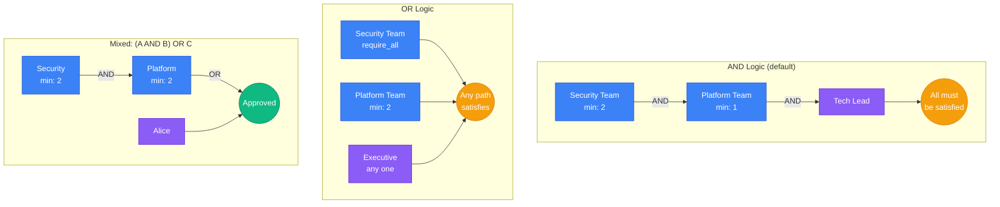

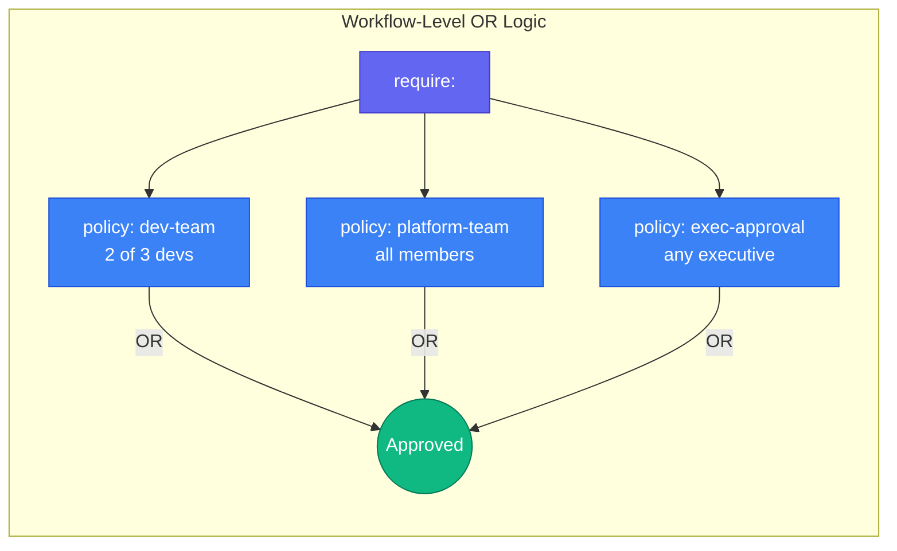

### Workflows

Workflows define approval requirements and actions:

```yaml
workflows:
  my-workflow:
    description: "Optional description"

    # Trigger conditions (for filtering)
    trigger:
      environment: production

    # Approval requirements (OR logic between items)
    require:
      - policy: dev-team
      - policy: security
      # Or inline approvers:
      - approvers: [alice, bob]
        require_all: true

    # Issue configuration
    issue:
      title: "Approval: {{version}}"
      body: |                          # Inline custom template (optional)
        ## My Custom Approval Issue
        Version: {{.Version}}
        Requested by: @{{.Requestor}}
        {{.GroupsTable}}
      body_file: "templates/my-template.md"  # Or load from file
      labels: [production, deploy]
      assignees_from_policy: true

    # Actions on approval
    on_approved:
      create_tag: true
      tag_prefix: "v"  # Creates v1.2.3
      close_issue: true
      comment: "Approved! Tag {{version}} created."

    # Actions on denial
    on_denied:
      close_issue: true
      comment: "Denied by {{denier}}."

    # Actions when issue is manually closed
    on_closed:
      delete_tag: true   # Delete the tag if issue is closed
      comment: "Deployment cancelled. Tag {{tag}} deleted."
```

### Tagging Configuration

Control how tags are created per workflow:

```yaml
workflows:
  dev-deploy:
    require:
      - policy: dev-team
    on_approved:
      tagging:
        enabled: true
        start_version: "0.1.0"      # No 'v' prefix, start at 0.1.0
        auto_increment: patch        # Auto-bump: 0.1.0 -> 0.1.1 -> 0.1.2
        env_prefix: "dev-"           # Creates: dev-0.1.0, dev-0.1.1

  staging-deploy:
    require:
      - policy: qa-team
    on_approved:
      tagging:
        enabled: true
        start_version: "v1.0.0"     # 'v' prefix (inferred from start_version)
        auto_increment: minor        # v1.0.0 -> v1.1.0 -> v1.2.0
        env_prefix: "staging-"       # Creates: staging-v1.0.0

  production-deploy:
    require:
      - policy: prod-team
    on_approved:
      tagging:
        enabled: true
        start_version: "v1.0.0"     # Manual version required (no auto_increment)
```

**Tagging options:**

| Option | Description |
|--------|-------------|
| `enabled` | Enable tag creation |
| `start_version` | Starting version and format (e.g., "v1.0.0" or "1.0.0") |
| `prefix` | Version prefix (inferred from `start_version` if not set) |
| `auto_increment` | Auto-bump: `major`, `minor`, `patch`, or omit for manual |
| `env_prefix` | Environment prefix (e.g., "dev-" creates "dev-v1.0.0") |

### Custom Issue Templates

You can fully customize the issue body using Go templates. Use `body` for inline templates or `body_file` to load from a file.

**Available template variables:**

| Variable | Description |
|----------|-------------|
| `{{.Title}}` | Issue title |
| `{{.Description}}` | Workflow description |
| `{{.Version}}` | Semver version |
| `{{.Requestor}}` | GitHub username who requested |
| `{{.Environment}}` | Environment name |
| `{{.RunURL}}` | Link to workflow run |
| `{{.RepoURL}}` | Repository URL |
| `{{.CommitSHA}}` | Full commit SHA |
| `{{.CommitURL}}` | Link to commit |
| `{{.Branch}}` | Branch name |
| `{{.GroupsTable}}` | Pre-rendered approval status table |
| `{{.Timestamp}}` | Request timestamp |
| `{{.PreviousVersion}}` | Previous version/tag |
| `{{.CommitsCount}}` | Number of commits in this release |
| `{{.HasJiraIssues}}` | Boolean - whether Jira issues exist |
| `{{.JiraIssues}}` | Array of Jira issue data |
| `{{.JiraIssuesTable}}` | Pre-rendered Jira issues table |
| `{{.PipelineTable}}` | Pre-rendered deployment pipeline table |
| `{{.PipelineMermaid}}` | Pre-rendered Mermaid flowchart diagram |
| `{{.Vars.key}}` | Custom variables |

**Template functions:**

| Function | Example | Description |
|----------|---------|-------------|
| `slice` | `{{slice .CommitSHA 0 7}}` | Substring (short SHA) |
| `title` | `{{.Environment \| title}}` | Title case |
| `upper` | `{{.Version \| upper}}` | Uppercase |
| `lower` | `{{.Version \| lower}}` | Lowercase |
| `join` | `{{join .Groups ","}}` | Join array |
| `contains` | `{{if contains .Branch "feature"}}` | Check substring |
| `replace` | `{{replace .Version "v" ""}}` | Replace string |
| `default` | `{{default "N/A" .Environment}}` | Default value |

**Example custom template file** (`.github/templates/deploy.md`):

```markdown
## {{.Title}}

### Release Information

- **Version:** `{{.Version}}`
- **Requested by:** @{{.Requestor}}
{{- if .CommitSHA}}
- **Commit:** [{{slice .CommitSHA 0 7}}]({{.CommitURL}})
{{- end}}
{{- if .CommitsCount}}
- **Changes:** {{.CommitsCount}} commits since {{.PreviousVersion}}
{{- end}}

{{if .HasJiraIssues}}
### Jira Issues

{{.JiraIssuesTable}}
{{end}}

### Approval Status

{{.GroupsTable}}

---

**Approve:** Comment `approve` | **Deny:** Comment `deny`
```

### Defaults

Global defaults that apply to all workflows:

```yaml
defaults:
  timeout: 72h                    # Default approval timeout
  allow_self_approval: false      # Whether requestors can approve their own requests
  issue_labels:                   # Labels added to all approval issues
    - approval-required
```

### Semver

Configure version handling:

```yaml
semver:
  prefix: "v"              # Tag prefix (v1.2.3)
  strategy: input          # Use version from input
  validate: true           # Validate semver format
  allow_prerelease: true   # Allow prerelease versions (e.g., v1.0.0-beta.1)
  auto:                    # Label-based auto-increment (when strategy: auto)
    major_labels: [breaking, major]
    minor_labels: [feature, minor]
    patch_labels: [fix, patch, bug]
```

---

## Complete Configuration Reference

This section documents **every configuration option** available in `approvals.yml`.

### Top-Level Structure

```yaml
version: 1                    # Required: config version (always 1)
defaults: { ... }             # Optional: global defaults
policies: { ... }             # Required: reusable approval policies
workflows: { ... }            # Required: approval workflows
semver: { ... }               # Optional: version handling settings
```

### `defaults` Options

| Key | Type | Default | Description |
|-----|------|---------|-------------|
| `timeout` | duration | `72h` | Timeout for blocking `check` action with `wait: true`. Use hours (e.g., `168h` for 1 week). Not needed for event-driven workflows. |
| `allow_self_approval` | bool | `false` | Whether the requestor can approve their own request |
| `issue_labels` | string[] | `[]` | Labels added to all approval issues |

### `policies.<name>` Options (Simple Format)

| Key | Type | Default | Description |
|-----|------|---------|-------------|
| `approvers` | string[] | - | List of usernames or `team:slug` references |
| `min_approvals` | int | 0 | Number of approvals required (0 = use `require_all`) |
| `require_all` | bool | `false` | If true, ALL approvers must approve |

### `policies.<name>` Options (Advanced Format)

| Key | Type | Default | Description |
|-----|------|---------|-------------|
| `from` | source[] | - | List of approver sources with individual thresholds |
| `logic` | string | `"and"` | How to combine sources: `"and"` or `"or"` |

**Approver Source Options (`from[]`):**

| Key | Type | Default | Description |
|-----|------|---------|-------------|
| `team` | string | - | Team slug (e.g., `"platform"` or `"org/platform"`) |
| `user` | string | - | Single username |
| `users` | string[] | - | List of usernames |
| `min_approvals` | int | 1 | Approvals required from this source |
| `require_all` | bool | `false` | All from this source must approve |
| `logic` | string | - | Logic to next source: `"and"` or `"or"` |

### `workflows.<name>` Options

| Key | Type | Default | Description |
|-----|------|---------|-------------|
| `description` | string | - | Human-readable description |
| `trigger` | map | - | Trigger conditions (for filtering) |
| `require` | requirement[] | - | **Required:** Approval requirements (OR logic between items) |
| `issue` | object | - | Issue creation settings |
| `on_approved` | object | - | Actions when approved |
| `on_denied` | object | - | Actions when denied |
| `on_closed` | object | - | Actions when issue is manually closed |
| `pipeline` | object | - | Progressive deployment pipeline config |

### `workflows.<name>.require[]` Options

| Key | Type | Default | Description |
|-----|------|---------|-------------|
| `policy` | string | - | Reference to a defined policy |
| `approvers` | string[] | - | Inline approvers (alternative to policy) |
| `min_approvals` | int | - | Override policy's min_approvals |
| `require_all` | bool | - | Override policy's require_all |

### `workflows.<name>.issue` Options

| Key | Type | Default | Description |
|-----|------|---------|-------------|
| `title` | string | `"Approval Required: {workflow}"` | Issue title (supports `{{version}}`, `{{environment}}`, `{{workflow}}`) |
| `body` | string | - | Custom issue body template (Go template syntax) |
| `body_file` | string | - | Path to template file (relative to `.github/`) |
| `labels` | string[] | `[]` | Additional labels for this workflow |
| `assignees_from_policy` | bool | `false` | Auto-assign individual users from policies (max 10) |

### `workflows.<name>.on_approved` Options

| Key | Type | Default | Description |
|-----|------|---------|-------------|
| `create_tag` | bool | `false` | Create a git tag (uses input version) |
| `close_issue` | bool | `false` | Close the issue after approval |
| `comment` | string | - | Comment to post (supports `{{version}}`, `{{satisfied_group}}`) |
| `tagging` | object | - | Advanced tagging configuration |

### `workflows.<name>.on_approved.tagging` Options

| Key | Type | Default | Description |
|-----|------|---------|-------------|
| `enabled` | bool | `false` | Enable tag creation |
| `start_version` | string | `"0.0.0"` | Initial version (e.g., `"v1.0.0"` or `"1.0.0"`) |
| `prefix` | string | (inferred) | Version prefix (inferred from `start_version`) |
| `auto_increment` | string | - | Auto-bump: `"major"`, `"minor"`, `"patch"`, or omit for manual |
| `env_prefix` | string | - | Environment prefix (e.g., `"dev-"` creates `"dev-v1.0.0"`) |

### `workflows.<name>.on_denied` Options

| Key | Type | Default | Description |
|-----|------|---------|-------------|
| `close_issue` | bool | `false` | Close the issue after denial |
| `comment` | string | - | Comment to post (supports `{{denier}}`) |

### `workflows.<name>.on_closed` Options

| Key | Type | Default | Description |
|-----|------|---------|-------------|
| `delete_tag` | bool | `false` | Delete the associated tag when issue is closed |
| `comment` | string | - | Comment to post (supports `{{tag}}`, `{{version}}`) |

### `workflows.<name>.pipeline` Options

| Key | Type | Default | Description |
|-----|------|---------|-------------|
| `stages` | stage[] | - | **Required:** Ordered list of deployment stages |
| `track_prs` | bool | `false` | Include merged PRs in issue body |
| `track_commits` | bool | `false` | Include commits in issue body |
| `compare_from_tag` | string | - | Tag pattern to compare from (e.g., `"v*"`) |
| `show_mermaid_diagram` | bool | `true` | Show visual Mermaid flowchart of pipeline stages |
| `release_strategy` | object | - | Release candidate selection strategy |

### `workflows.<name>.pipeline.stages[]` Options

| Key | Type | Default | Description |
|-----|------|---------|-------------|
| `name` | string | - | **Required:** Stage name (e.g., `"dev"`, `"prod"`) |
| `environment` | string | - | GitHub environment name |
| `policy` | string | - | Approval policy for this stage |
| `approvers` | string[] | - | Inline approvers (alternative to policy) |
| `on_approved` | string | - | Comment to post when stage is approved |
| `create_tag` | bool | `false` | Create a git tag at this stage |
| `is_final` | bool | `false` | Close issue after this stage |
| `auto_approve` | bool | `false` | Automatically approve without human intervention |

### `workflows.<name>.pipeline.release_strategy` Options

| Key | Type | Default | Description |
|-----|------|---------|-------------|
| `type` | string | `"tag"` | Strategy: `"tag"`, `"branch"`, `"label"`, `"milestone"` |
| `branch` | object | - | Branch strategy settings |
| `label` | object | - | Label strategy settings |
| `milestone` | object | - | Milestone strategy settings |
| `auto_create` | object | - | Auto-create next release artifact |

### `release_strategy.branch` Options

| Key | Type | Default | Description |
|-----|------|---------|-------------|
| `pattern` | string | `"release/{{version}}"` | Branch naming pattern |
| `base_branch` | string | `"main"` | Branch to compare against |
| `delete_after_release` | bool | `false` | Delete branch after prod deployment |

### `release_strategy.label` Options

| Key | Type | Default | Description |
|-----|------|---------|-------------|
| `pattern` | string | `"release:{{version}}"` | Label naming pattern |
| `pending_label` | string | - | Label for PRs awaiting release assignment |
| `remove_after_release` | bool | `false` | Remove labels after prod deployment |

### `release_strategy.milestone` Options

| Key | Type | Default | Description |
|-----|------|---------|-------------|
| `pattern` | string | `"v{{version}}"` | Milestone naming pattern |
| `close_after_release` | bool | `false` | Close milestone after prod deployment |

### `release_strategy.auto_create` Options

| Key | Type | Default | Description |
|-----|------|---------|-------------|
| `enabled` | bool | `false` | Enable auto-creation on final stage completion |
| `next_version` | string | `"patch"` | Version increment: `"patch"`, `"minor"`, `"major"` |
| `create_issue` | bool | `false` | Create new approval issue for next release |
| `comment` | string | - | Comment to post about next release |

### `semver` Options

| Key | Type | Default | Description |
|-----|------|---------|-------------|
| `prefix` | string | `"v"` | Tag prefix |
| `strategy` | string | `"input"` | Version strategy: `"input"`, `"auto"` |
| `validate` | bool | `false` | Validate semver format |
| `allow_prerelease` | bool | `false` | Allow prerelease versions (e.g., `v1.0.0-beta.1`) |
| `auto` | object | - | Label-based auto-increment settings |

### `semver.auto` Options

| Key | Type | Default | Description |
|-----|------|---------|-------------|
| `major_labels` | string[] | `[]` | PR labels that trigger major bump |
| `minor_labels` | string[] | `[]` | PR labels that trigger minor bump |
| `patch_labels` | string[] | `[]` | PR labels that trigger patch bump |

---

## Feature Details

### Approval Keywords

Users can approve or deny requests by commenting on the issue:

**Approval keywords:** `approve`, `approved`, `lgtm`, `yes`, `/approve`

**Denial keywords:** `deny`, `denied`, `reject`, `rejected`, `no`, `/deny`

### Team Support

To use GitHub team-based approvers, you need elevated permissions. The standard `GITHUB_TOKEN` cannot list team members. Use a GitHub App token:

```yaml
jobs:
  process:
    runs-on: ubuntu-latest
    steps:
      - uses: actions/checkout@v4

      # Generate GitHub App token
      - uses: actions/create-github-app-token@v2
        id: app-token
        with:
          app-id: ${{ vars.APP_ID }}
          private-key: ${{ secrets.APP_PRIVATE_KEY }}

      # Use the app token for team membership checks
      - uses: jamengual/enterprise-approval-engine@v1
        with:
          action: process-comment
          issue_number: ${{ github.event.issue.number }}
          token: ${{ steps.app-token.outputs.token }}
```

**Required GitHub App permissions:**

- `Organization > Members: Read` - To list team members

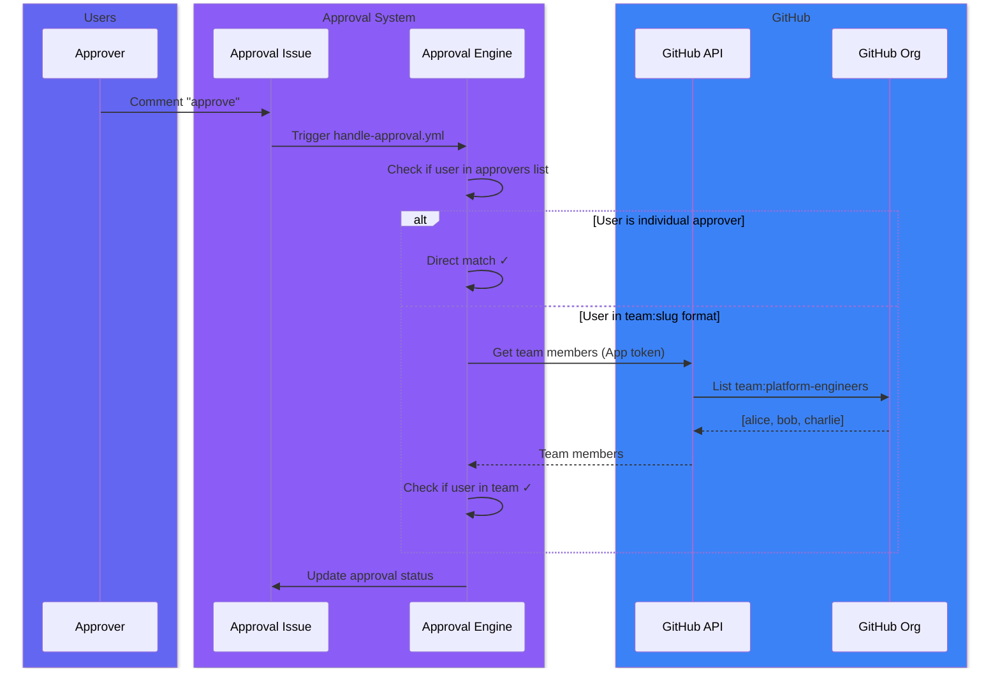

### Progressive Deployment Pipelines

Track deployments through multiple environments with a single approval issue. As each stage is approved, the issue updates to show progress and automatically advances to the next stage.

#### Pipeline Configuration

```yaml
# .github/approvals.yml or external config
version: 1

policies:
  developers:
    approvers: [dev1, dev2, dev3]
    min_approvals: 1

  qa-team:
    approvers: [qa1, qa2]
    min_approvals: 1

  tech-leads:
    approvers: [lead1, lead2]
    min_approvals: 1

  production-approvers:
    approvers: [sre1, sre2, security-lead]
    require_all: true

workflows:
  deploy:
    description: "Deploy through all environments (dev → qa → stage → prod)"
    require:
      - policy: developers  # Initial approval to start pipeline
    pipeline:
      track_prs: true       # Include PRs in the issue body
      track_commits: true   # Include commits in the issue body
      stages:
        - name: dev
          environment: development
          policy: developers
          on_approved: "✅ **DEV** deployment approved! Proceeding to QA..."
        - name: qa
          environment: qa
          policy: qa-team
          on_approved: "✅ **QA** deployment approved! Proceeding to STAGING..."
        - name: stage
          environment: staging
          policy: tech-leads
          on_approved: "✅ **STAGING** deployment approved! Ready for PRODUCTION..."
        - name: prod
          environment: production
          policy: production-approvers
          on_approved: "🚀 **PRODUCTION** deployment complete!"
          create_tag: true   # Create tag when PROD is approved
          is_final: true     # Close issue after this stage
    on_approved:
      close_issue: true
      comment: |
        🎉 **Deployment Complete!**

        Version `{{version}}` has been deployed to all environments.
```

#### Pipeline Workflow Example

```yaml
# .github/workflows/request-pipeline.yml
name: Request Pipeline Deployment

on:
  workflow_dispatch:
    inputs:
      version:
        description: 'Version to deploy'
        required: true
        type: string

permissions:
  contents: write
  issues: write
  pull-requests: read  # Required for PR tracking

jobs:
  request:
    runs-on: ubuntu-latest
    steps:
      - uses: actions/checkout@v4
        with:
          fetch-depth: 0  # Needed for commit/PR comparison

      - uses: jamengual/enterprise-approval-engine@v1
        id: approval
        with:
          action: request
          workflow: deploy
          version: ${{ inputs.version }}
          token: ${{ secrets.GITHUB_TOKEN }}

      - name: Output Results
        run: |
          echo "## Pipeline Deployment Started" >> $GITHUB_STEP_SUMMARY
          echo "- **Issue:** #${{ steps.approval.outputs.issue_number }}" >> $GITHUB_STEP_SUMMARY
          echo "- **URL:** ${{ steps.approval.outputs.issue_url }}" >> $GITHUB_STEP_SUMMARY
```

#### How It Works

1. **Issue Creation**: When triggered, creates a single issue showing all stages with a visual Mermaid diagram and progress table:

```markdown
## 🚀 Deployment Pipeline: v1.2.0

### Pipeline Flow

​```mermaid
flowchart LR
    DEV(⏳ DEV)
    QA(⬜ QA)
    STAGE(⬜ STAGE)
    PROD(⬜ PROD)
    DEV --> QA --> STAGE --> PROD

    classDef completed fill:#28a745,stroke:#1e7e34,color:#fff
    classDef current fill:#ffc107,stroke:#d39e00,color:#000
    classDef pending fill:#6c757d,stroke:#545b62,color:#fff
    class DEV current
    class QA,STAGE,PROD pending
​```

### Deployment Progress

| Stage | Status | Approver | Time |
|-------|--------|----------|------|
| DEV | ⏳ Awaiting | - | - |
| QA | ⬜ Pending | - | - |
| STAGE | ⬜ Pending | - | - |
| PROD | ⬜ Pending | - | - |

**Current Stage:** DEV
```

The Mermaid diagram provides an at-a-glance view with color-coded nodes:
- 🟢 **Green** - Completed stages
- 🟡 **Yellow** - Current stage awaiting approval
- ⚪ **Gray** - Pending stages
- 🔵 **Cyan** - Auto-approve stages

To disable the Mermaid diagram, set `show_mermaid_diagram: false` in the pipeline config.

2. **Stage Progression**: Comment `approve` to advance to the next stage. Both the diagram and table update automatically:

```markdown
| Stage | Status | Approver | Time |
|-------|--------|----------|------|
| DEV | ✅ Deployed | @developer1 | Dec 9 10:30 |
| QA | ✅ Deployed | @qa-lead | Dec 9 14:15 |
| STAGE | ⏳ Awaiting | - | - |
| PROD | ⬜ Pending | - | - |

**Current Stage:** STAGE
```

3. **PR and Commit Tracking**: Release managers see exactly what's being deployed:

```markdown
### Pull Requests in this Release

| PR | Title | Author |
|----|-------|--------|
| [#42](https://...) | Add user authentication | @alice |
| [#45](https://...) | Fix payment processing bug | @bob |

### Commits

- [`abc1234`](https://...) feat: add OAuth2 support
- [`def5678`](https://...) fix: handle null payments
```

4. **Completion**: When the final stage is approved:
   - Tag is created (if `create_tag: true`)
   - Completion comment is posted
   - Issue is automatically closed

#### Pipeline Stage Options

| Option | Description |
|--------|-------------|
| `name` | Stage name (displayed in table) |
| `environment` | GitHub environment name |
| `policy` | Approval policy for this stage |
| `approvers` | Inline approvers (alternative to policy) |
| `on_approved` | Message to post when stage is approved |
| `create_tag` | Create a git tag at this stage |
| `is_final` | Close the issue after this stage |
| `auto_approve` | Automatically approve this stage without human intervention |
| `approval_mode` | Override workflow approval mode for this stage |

#### Approval Modes

Choose how approvers interact with approval requests:

| Mode | Description |
|------|-------------|
| `comments` | (Default) Approvers comment `/approve` or `approve` on the issue |
| `sub_issues` | Creates a sub-issue for each stage - close to approve |
| `hybrid` | Mix modes per stage - use `approval_mode` on each stage |

**Sub-Issue Approval Example:**

```yaml
workflows:
  deploy:
    approval_mode: sub_issues
    sub_issue_settings:
      title_template: "⏳ Approve: {{stage}} for {{version}}"  # Changes to ✅ when approved
      labels: [approval-stage]
      protection:
        only_assignee_can_close: true   # Prevents unauthorized approvals
        prevent_parent_close: true       # Parent can't close until all approved
    pipeline:
      stages:
        - name: dev
          policy: developers
        - name: prod
          policy: production-approvers
```

With sub-issues, the parent issue shows a table of approval sub-issues:

```markdown
### 📋 Approval Sub-Issues

| Stage | Sub-Issue | Status | Assignees |
|-------|-----------|--------|----------|
| DEV | #124 | ⏳ Awaiting | @alice, @bob |
| PROD | #125 | ⏳ Awaiting | @sre1, @sre2 |
```

**Hybrid Mode (per-stage override):**

```yaml
workflows:
  deploy:
    approval_mode: comments  # Default for this workflow
    pipeline:
      stages:
        - name: dev
          policy: developers
          # Uses comments (workflow default)
        - name: prod
          policy: production-approvers
          approval_mode: sub_issues  # Override for production only
```

#### Enhanced Comments UX

The action includes enhanced comment-based approval UX:

- **Emoji Reactions**: Automatic reactions on approval comments
  - 👍 Approved
  - 👎 Denied
  - 👀 Seen (processing)

- **Quick Actions Section**: Issue body includes a command reference table:

```markdown
### ⚡ Quick Actions

| Action | Command | Description |
|--------|---------|-------------|
| ✅ Approve | `/approve` | Approve the **DEV** stage |
| ❌ Deny | `/deny [reason]` | Deny with optional reason |
| 📊 Status | `/status` | Show current approval status |
```

**Configure via `comment_settings`:**

```yaml
workflows:
  deploy:
    comment_settings:
      react_to_comments: true     # Add emoji reactions (default: true)
      show_quick_actions: true    # Show Quick Actions section (default: true)
```

#### Auto-Approve for Lower Environments

Use `auto_approve: true` on pipeline stages that should be automatically approved without human intervention. This is ideal for lower environments like `dev` or `integration` where you want to speed up the pipeline while still maintaining approval gates for production.

**Example with auto-approve:**

```yaml
workflows:
  deploy:
    description: "Deploy through environments"
    pipeline:
      stages:
        - name: dev
          environment: development
          auto_approve: true              # Automatically approved
          on_approved: "🤖 DEV auto-deployed"
        - name: integration
          environment: integration
          auto_approve: true              # Automatically approved
          on_approved: "🤖 INTEGRATION auto-deployed"
        - name: staging
          environment: staging
          policy: qa-team                 # Requires manual approval
          on_approved: "✅ STAGING approved"
        - name: production
          environment: production
          policy: production-approvers    # Requires manual approval
          create_tag: true
          is_final: true
```

**How it works:**

1. When a pipeline issue is created, all initial `auto_approve: true` stages are automatically completed
2. When a stage is manually approved, any consecutive `auto_approve: true` stages that follow are also automatically completed
3. Auto-approved stages show with 🤖 indicator in the pipeline table
4. The approver is recorded as `[auto]` in the stage history

**Use cases:**

- **Development environments**: Deploy immediately without waiting for approval
- **Integration testing**: Let CI/CD pipeline progress automatically through test environments
- **Canary deployments**: Auto-approve canary stage, require approval for full rollout

#### Pipeline Config Options

| Option | Default | Description |
|--------|---------|-------------|
| `track_prs` | `false` | Include merged PRs in the issue body |
| `track_commits` | `false` | Include commits since last tag |
| `compare_from_tag` | - | Custom tag pattern to compare from |
| `show_mermaid_diagram` | `true` | Show visual Mermaid flowchart of pipeline stages |

**Note:** PR tracking requires `pull-requests: read` permission in your workflow.

### Release Candidate Strategies

In enterprise environments, PRs merged to main aren't always immediate release candidates. The approval engine supports three strategies for selecting which PRs belong to a release:

#### Strategy Types

| Strategy | Description | Use Case |
|----------|-------------|----------|
| `tag` | PRs between two git tags (default) | Simple releases, trunk-based development |
| `branch` | PRs merged to a release branch | GitFlow, release branches |
| `label` | PRs with a specific release label | Flexible selection, batched releases |
| `milestone` | PRs assigned to a GitHub milestone | Roadmap-aligned releases |

#### Configuration

```yaml
# .github/approvals.yml
workflows:
  deploy:
    description: "Production deployment pipeline"
    pipeline:
      track_prs: true
      track_commits: true

      # Configure release selection strategy
      release_strategy:
        type: milestone  # or: tag, branch, label

        # Milestone strategy settings
        milestone:
          pattern: "v{{version}}"        # e.g., "v1.2.0"
          close_after_release: true       # Close milestone on prod completion

        # Auto-create next release artifact on completion
        auto_create:
          enabled: true
          next_version: patch             # or: minor, major
          create_issue: true              # Create new approval issue

      stages:
        - name: dev
          policy: developers
        - name: prod
          policy: production-approvers
          is_final: true
```

#### Branch Strategy

Use release branches for GitFlow-style development:

```yaml
release_strategy:
  type: branch
  branch:
    pattern: "release/{{version}}"  # Creates release/v1.2.0
    base_branch: main               # Compare against main
    delete_after_release: true      # Cleanup after prod deploy

  auto_create:
    enabled: true
    next_version: minor
```

**How it works:**
1. Create a release branch: `release/v1.2.0`
2. PRs merged to the branch are release candidates
3. Request approval for that version
4. Approval issue shows all PRs in the release branch
5. After prod, branch is deleted (optional) and next branch is created

#### Label Strategy

Use labels for flexible PR selection:

```yaml
release_strategy:
  type: label
  label:
    pattern: "release:{{version}}"      # e.g., "release:v1.2.0"
    pending_label: "pending-release"    # Applied to merged PRs awaiting release
    remove_after_release: true          # Remove label after prod deploy

  auto_create:
    enabled: true
    next_version: patch
```

**How it works:**
1. PRs merged to main get the `pending-release` label
2. Release manager applies `release:v1.2.0` to selected PRs
3. Request approval for v1.2.0
4. Approval issue shows only PRs with that label
5. After prod, labels are removed and next release label is created

#### Milestone Strategy

Use milestones for roadmap-aligned releases:

```yaml
release_strategy:
  type: milestone
  milestone:
    pattern: "Release {{version}}"       # e.g., "Release 1.2.0"
    close_after_release: true            # Close milestone on completion

  auto_create:
    enabled: true
    next_version: minor
    create_issue: true                   # Auto-create next approval issue
```

**How it works:**
1. Create milestone: "Release 1.2.0"
2. Assign PRs to the milestone during development
3. Request approval for v1.2.0
4. Approval issue shows all PRs in the milestone
5. After prod, milestone is closed and next milestone is created

#### Auto-Creation on Completion

When the final stage (prod) is approved, automatically prepare for the next release:

```yaml
auto_create:
  enabled: true
  next_version: patch      # Calculate next: patch, minor, or major
  create_issue: true       # Create new approval issue immediately
  comment: |               # Custom message (optional)
    🚀 **Next release prepared:** {{version}}
```

This creates:
- **Branch strategy:** New release branch from main
- **Label strategy:** New release label
- **Milestone strategy:** New milestone

#### Cleanup Options

Each strategy has optional cleanup actions that run when the final stage (prod) is approved. **All cleanup options default to `false`** - cleanup is opt-in:

| Strategy | Cleanup Option | Description |
|----------|----------------|-------------|
| Branch | `delete_after_release` | Delete the release branch |
| Label | `remove_after_release` | Remove release labels from PRs |
| Milestone | `close_after_release` | Close the milestone |

```yaml
release_strategy:
  type: branch
  branch:
    pattern: "release/{{version}}"
    delete_after_release: false   # Keep branch for reference (default)

  type: milestone
  milestone:
    pattern: "v{{version}}"
    close_after_release: true     # Close milestone when done
```

#### Hotfix Deployments

For emergency hotfixes that need to bypass normal release workflows, create a separate workflow:

```yaml
# .github/approvals.yml
workflows:
  # Standard releases - full pipeline with milestone tracking
  deploy:
    description: "Standard release pipeline (dev → qa → stage → prod)"
    pipeline:
      release_strategy:
        type: milestone
        milestone:
          pattern: "v{{version}}"
          close_after_release: true
        auto_create:
          enabled: true
          next_version: minor
      stages:
        - name: dev
          policy: developers
        - name: qa
          policy: qa-team
        - name: stage
          policy: tech-leads
        - name: prod
          policy: production-approvers
          is_final: true

  # Hotfixes - skip stages, direct to prod
  hotfix:
    description: "Emergency hotfix - direct to production"
    pipeline:
      release_strategy:
        type: tag              # Simple tag-based, no cleanup needed
        # No auto_create - hotfixes are one-off
      stages:
        - name: prod
          policy: production-approvers
          create_tag: true
          is_final: true
    on_approved:
      close_issue: true
      comment: "🚨 Hotfix {{version}} deployed to production"
```

**Trigger hotfix vs regular release:**

```bash
# Regular release - goes through all stages
gh workflow run request-approval.yml -f workflow_name=deploy -f version=v1.3.0

# Hotfix - goes straight to prod
gh workflow run request-approval.yml -f workflow_name=hotfix -f version=v1.2.1
```

**Hotfix patterns:**

| Scenario | Strategy | Cleanup | Auto-Create |
|----------|----------|---------|-------------|
| Emergency fix | `tag` | None | Disabled |
| Patch release | `milestone` | `close_after_release: false` | Disabled |
| Multiple hotfixes | `branch` | `delete_after_release: false` | Disabled |

#### Release Strategy Benefits

| Strategy | Pros | Cons |
|----------|------|------|
| **Tag** | Simple, no extra workflow | All merged PRs included |
| **Branch** | Clear release scope, isolation | Branch management overhead |
| **Label** | Flexible selection, easy to change | Manual labeling required |
| **Milestone** | Roadmap visibility, planning integration | Requires milestone discipline |

**Recommendation:**

- Use **tag** for simple projects with continuous deployment
- Use **branch** for regulated environments needing release isolation
- Use **label** for batched releases with flexible scope
- Use **milestone** for roadmap-driven development with clear release planning

### Jira Integration

Automatically extract Jira issues from commits and branch names. The action supports two modes:

#### Links-Only Mode (No Auth Required)

Just provide `jira_base_url` to extract issue keys and display them as clickable links:

```yaml
- uses: jamengual/enterprise-approval-engine@v1
  with:
    action: request
    workflow: production-deploy
    version: v1.2.0
    token: ${{ secrets.GITHUB_TOKEN }}
    jira_base_url: https://yourcompany.atlassian.net  # That's it!
```

This extracts issue keys (e.g., `PROJ-123`) from commit messages and branch names, displaying them as links in the approval issue:

```markdown
### Jira Issues
- [PROJ-123](https://yourcompany.atlassian.net/browse/PROJ-123)
- [PROJ-456](https://yourcompany.atlassian.net/browse/PROJ-456)
```

#### Full Mode (With API Access)

Add credentials to also fetch issue details and update Fix Versions:

```yaml
- uses: jamengual/enterprise-approval-engine@v1
  with:
    action: request
    workflow: production-deploy
    version: v1.2.0
    token: ${{ secrets.GITHUB_TOKEN }}
    # Jira configuration
    jira_base_url: https://yourcompany.atlassian.net
    jira_user_email: ${{ secrets.JIRA_EMAIL }}
    jira_api_token: ${{ secrets.JIRA_API_TOKEN }}
    jira_update_fix_version: 'true'
```

This displays rich issue information:

```markdown
### Jira Issues in this Release

| Key | Summary | Type | Status |
|-----|---------|------|--------|
| [PROJ-123](https://...) | Fix login bug | Bug | Done |
| [PROJ-456](https://...) | Add dark mode | Feature | In Progress |
```

**Comparison of modes:**

| Mode | Auth Required | Features |
|------|---------------|----------|
| Links-only | No | Issue keys as clickable links |
| Full | Yes | Links + summary, status, type emojis, Fix Version updates |

**Jira outputs:**

```yaml
- name: Use Jira Outputs
  run: |
    echo "Issues: ${{ steps.approval.outputs.jira_issues }}"
    # Output: PROJ-123,PROJ-456

    echo "Details: ${{ steps.approval.outputs.jira_issues_json }}"
    # Output: [{"key":"PROJ-123","summary":"Fix login bug",...}]
```

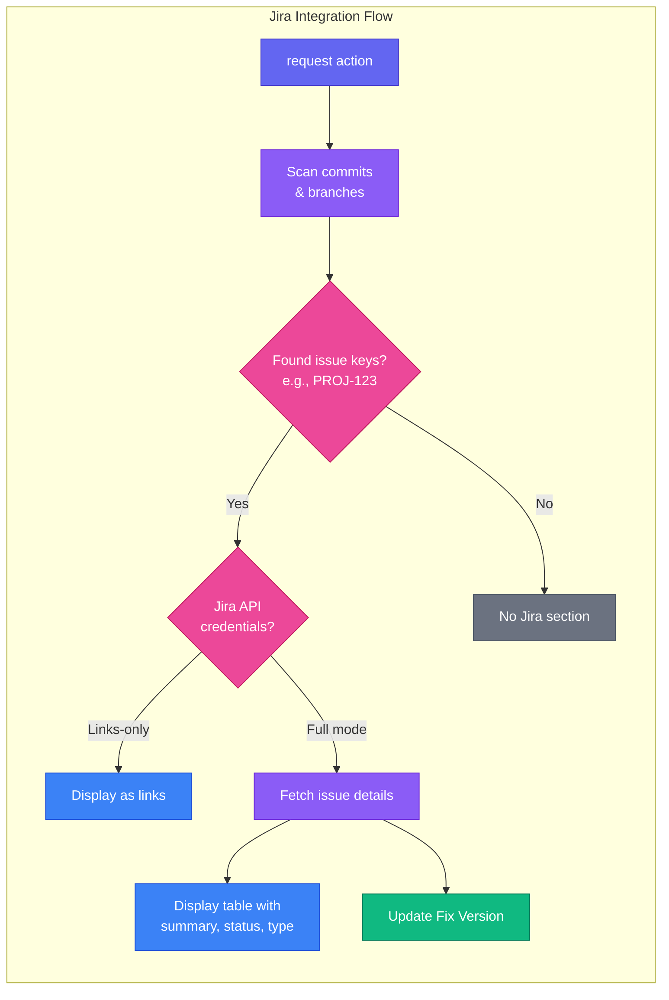

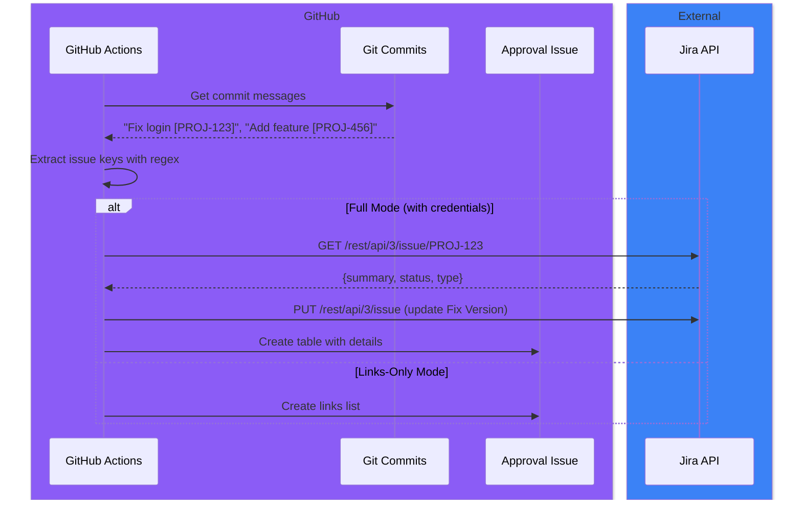

### Deployment Tracking

Create GitHub deployments for visibility in GitHub's deployment dashboard. This works independently of the `environment:` key in workflow YAML.

```yaml
- uses: jamengual/enterprise-approval-engine@v1
  id: approval
  with:
    action: request
    workflow: production-deploy
    version: v1.2.0
    token: ${{ secrets.GITHUB_TOKEN }}
    # Deployment tracking
    create_deployment: 'true'
    deployment_environment: production
    deployment_environment_url: https://myapp.example.com

- name: Update Deployment Status
  if: steps.approval.outputs.status == 'approved'
  run: |
    # Use the deployment_id to update status after actual deployment
    echo "Deployment ID: ${{ steps.approval.outputs.deployment_id }}"
```

**Where deployments appear:**

- Repository's **Deployments** tab
- Environment status badges on the repo page
- GitHub for Jira integration (if configured)
- GitHub API for CI/CD tooling

**Note:** This creates deployments via the GitHub Deployments API, which is separate from GitHub's native Environment Protection Rules. You can use both together or independently.

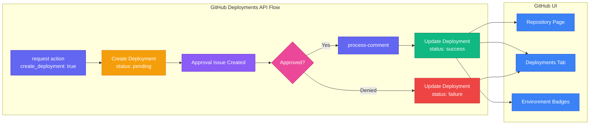

### Environment Deployment Approval

Integrate IssueOps approval with GitHub's native Environment Protection Rules. This allows you to:

- Use GitHub Environments for secrets and deployment tracking
- Require approval through your IssueOps workflow
- Automatically approve pending environment deployments when IssueOps approves

#### Two Integration Flows

```mermaid
flowchart TB
    subgraph "Flow A: With Environment Required Reviewers"
        A1[Workflow starts]:::workflow --> A2[Job with environment: prod]:::env
        A2 --> A3[Job WAITING for approval]:::pending
        A3 -.->|Meanwhile| A4[User approves IssueOps issue]:::user
        A4 --> A5[process-comment runs]:::workflow
        A5 --> A6[Calls GitHub API to approve environment]:::api
        A6 --> A7[Job proceeds with secrets]:::success
    end

    subgraph "Flow B: IssueOps Only - No Required Reviewers"
        B1[Request approval issue]:::issue --> B2[Wait for approval]:::pending
        B2 -.->|Days/weeks later| B3[User approves issue]:::user
        B3 --> B4[Trigger deploy workflow]:::workflow
        B4 --> B5[environment: prod for secrets only]:::env
        B5 --> B6[Deploy immediately]:::success
    end

    classDef workflow fill:#6366f1,stroke:#4338ca,color:#fff
    classDef env fill:#8b5cf6,stroke:#6d28d9,color:#fff
    classDef pending fill:#f59e0b,stroke:#d97706,color:#fff
    classDef user fill:#3b82f6,stroke:#1d4ed8,color:#fff
    classDef api fill:#ec4899,stroke:#be185d,color:#fff
    classDef issue fill:#a855f7,stroke:#7c3aed,color:#fff
    classDef success fill:#10b981,stroke:#047857,color:#fff
```

| Flow | Use Case | Environment Config | Max Approval Time |
|------|----------|-------------------|-------------------|
| **A** | Compliance requires GitHub's Built-in reviewers | Has Required Reviewers | 30 days (GitHub limit) |
| **B** | Flexible, long approvals | No Required Reviewers | Unlimited |

#### Flow A: With Environment Required Reviewers

Use this when you need GitHub's built-in Required Reviewers AND want IssueOps to trigger the approval automatically.

**Limitations:**

- Requires a PAT from a user who is a Required Reviewer (GITHUB_TOKEN won't work)
- 30-day maximum wait time (GitHub limit)
- GitHub Apps cannot be Required Reviewers

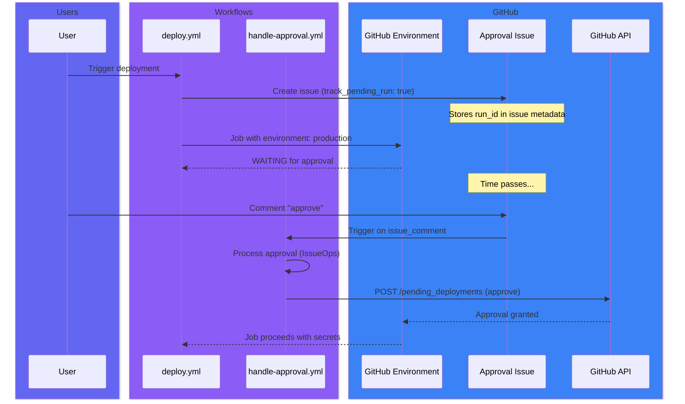

**deploy.yml (Flow A):**

```yaml
name: Deploy with Environment Approval

on:
  workflow_dispatch:
    inputs:
      version:
        required: true

jobs:
  request-approval:
    runs-on: ubuntu-latest
    steps:
      - uses: actions/checkout@v4
      - uses: jamengual/enterprise-approval-engine@v1
        with:
          action: request
          workflow: production-deploy
          version: ${{ inputs.version }}
          token: ${{ secrets.GITHUB_TOKEN }}
          track_pending_run: true  # Store run_id for later approval

  deploy:
    needs: request-approval
    runs-on: ubuntu-latest
    environment: production  # Has Required Reviewers
    steps:
      - run: echo "Deploying ${{ inputs.version }}"
```

**handle-approval.yml (Flow A):**

```yaml
name: Handle Approval

on:
  issue_comment:
    types: [created]

jobs:
  process:
    if: contains(github.event.issue.labels.*.name, 'approval-required')
    runs-on: ubuntu-latest
    steps:
      - uses: actions/checkout@v4
      - uses: jamengual/enterprise-approval-engine@v1
        with:
          action: process-comment
          issue_number: ${{ github.event.issue.number }}
          token: ${{ secrets.GITHUB_TOKEN }}
          # Also approve the pending environment deployment
          approve_environment_deployment: true
          environment_approval_token: ${{ secrets.REVIEWER_PAT }}
```

**Required Setup for Flow A:**

1. Add a user as Required Reviewer on the environment
2. Create a PAT for that user with `repo` scope
3. Store the PAT as `REVIEWER_PAT` secret
4. Configure `approve_environment_deployment: true` and `environment_approval_token`

#### Flow B: IssueOps Only (Recommended for Long Approvals)

Use this for quarterly deployments or any approval cycle >30 days. IssueOps is the sole approval gate.

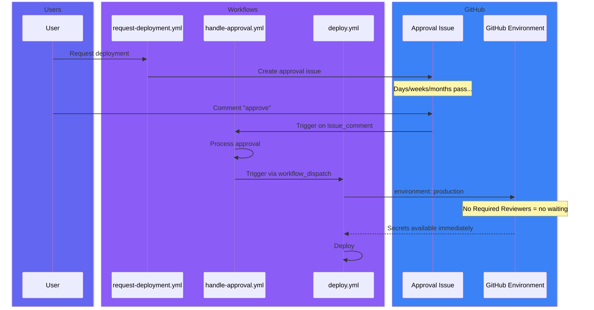

**Environment Settings (Flow B):**

```text
Environment: production
├── Required reviewers: NONE (empty)
├── Wait timer: 0
├── Deployment branches: All (or specific)
└── Secrets: PROD_API_KEY, PROD_DB_URL, etc.
```

**request-deployment.yml (Flow B):**

```yaml
name: Request Deployment

on:
  workflow_dispatch:
    inputs:
      version:
        required: true

jobs:
  request:
    runs-on: ubuntu-latest
    steps:
      - uses: actions/checkout@v4
      - uses: jamengual/enterprise-approval-engine@v1
        with:
          action: request
          workflow: production-deploy
          version: ${{ inputs.version }}
          token: ${{ secrets.GITHUB_TOKEN }}
```

**handle-approval.yml (Flow B):**

```yaml
name: Handle Approval

on:
  issue_comment:
    types: [created]

jobs:
  process:
    if: contains(github.event.issue.labels.*.name, 'approval-required')
    runs-on: ubuntu-latest
    steps:
      - uses: actions/checkout@v4
      - uses: jamengual/enterprise-approval-engine@v1
        id: process
        with:
          action: process-comment
          issue_number: ${{ github.event.issue.number }}
          token: ${{ secrets.GITHUB_TOKEN }}

      # Trigger deployment after approval
      - name: Trigger Deployment
        if: steps.process.outputs.status == 'approved'
        env:
          GH_TOKEN: ${{ secrets.GITHUB_TOKEN }}
        run: |
          gh workflow run deploy.yml \
            -f version=${{ steps.process.outputs.tag }} \
            -f approval_issue=${{ github.event.issue.number }}
```

**deploy.yml (Flow B):**

```yaml
name: Deploy

on:
  workflow_dispatch:
    inputs:
      version:
        required: true
      approval_issue:
        required: true

jobs:
  deploy:
    runs-on: ubuntu-latest
    environment: production  # For secrets only, no approval gate
    steps:
      - uses: actions/checkout@v4

      # Optional: Verify approval status
      - uses: jamengual/enterprise-approval-engine@v1
        id: verify
        with:
          action: check
          issue_number: ${{ inputs.approval_issue }}
          token: ${{ secrets.GITHUB_TOKEN }}

      - name: Verify Approval
        if: steps.verify.outputs.status != 'approved'
        run: |
          echo "::error::Issue #${{ inputs.approval_issue }} is not approved!"
          exit 1

      - name: Deploy
        run: echo "Deploying ${{ inputs.version }}"
        env:
          PROD_API_KEY: ${{ secrets.PROD_API_KEY }}
```

#### Environment Approval Inputs

| Input | Description | Required | Default |
|-------|-------------|----------|---------|
| `track_pending_run` | Store run ID for later environment approval (Flow A) | No | `false` |
| `approve_environment_deployment` | Also approve pending environment deployment | No | `false` |
| `environment_approval_token` | PAT from a Required Reviewer | No | Uses main token |

#### Environment Approval Outputs

| Output | Description |
|--------|-------------|
| `pending_run_id` | Workflow run ID stored for environment approval |
| `environment_deployment_approved` | Whether environment deployment was approved |

### External Config Repository

Store approval configs in a shared repository for centralized policy management:

```yaml
- uses: jamengual/enterprise-approval-engine@v1
  with:
    action: request
    workflow: production-deploy
    token: ${{ secrets.GITHUB_TOKEN }}
    config_repo: myorg/.github  # Shared config repo
```

**Config resolution order:**

1. `{repo-name}_approvals.yml` in the external repo (e.g., `myapp_approvals.yml`)
2. `approvals.yml` in the external repo (shared default)
3. `.github/approvals.yml` in the current repo (local fallback)

**Example organization structure:**

```text
myorg/.github/
├── myapp_approvals.yml      # App-specific config
├── backend_approvals.yml    # Backend repos config
└── approvals.yml            # Default for all repos
```

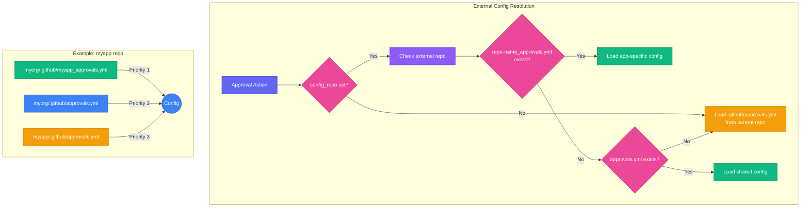

### Blocking Approvals

For workflows that need to wait for approval before proceeding:

```yaml
name: Deploy with Blocking Approval

on:
  workflow_dispatch:
    inputs:
      version:
        required: true
        type: string

jobs:
  request-approval:
    runs-on: ubuntu-latest
    outputs:
      issue_number: ${{ steps.request.outputs.issue_number }}
    steps:
      - uses: actions/checkout@v4
      - uses: jamengual/enterprise-approval-engine@v1
        id: request
        with:
          action: request
          workflow: production-deploy
          version: ${{ inputs.version }}
          token: ${{ secrets.GITHUB_TOKEN }}

  wait-for-approval:
    needs: request-approval
    runs-on: ubuntu-latest
    outputs:
      status: ${{ steps.check.outputs.status }}
      tag: ${{ steps.check.outputs.tag }}
    steps:
      - uses: actions/checkout@v4
      - uses: jamengual/enterprise-approval-engine@v1
        id: check
        with:
          action: check
          issue_number: ${{ needs.request-approval.outputs.issue_number }}
          wait: 'true'           # Poll until approved/denied
          timeout: '4h'          # Max wait time
          token: ${{ secrets.GITHUB_TOKEN }}

  deploy:
    needs: [request-approval, wait-for-approval]
    if: needs.wait-for-approval.outputs.status == 'approved'
    runs-on: ubuntu-latest
    steps:
      - name: Deploy
        run: |
          echo "Deploying ${{ needs.wait-for-approval.outputs.tag }}"
```

**Note:** Blocking workflows keep the runner active, which consumes GitHub Actions minutes. For cost-sensitive scenarios, use the event-driven approach (separate `process-comment` workflow).

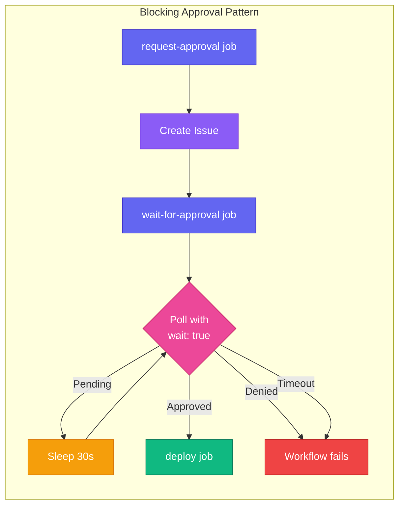

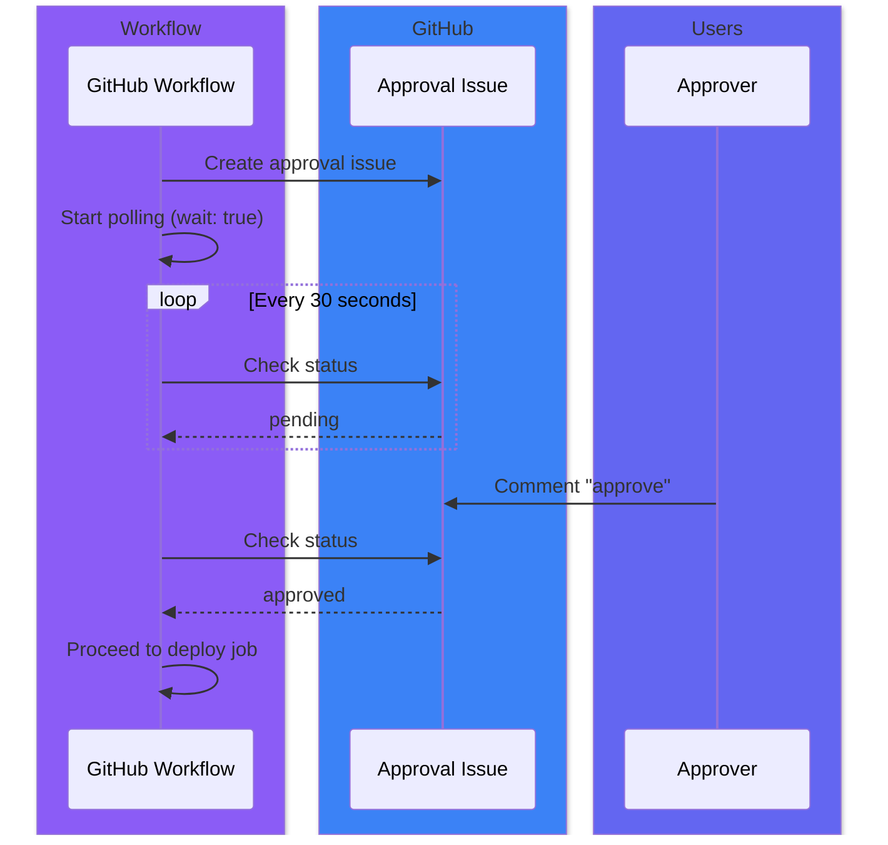

### Tag Deletion on Issue Close

Optionally delete tags when approval issues are manually closed:

```yaml
workflows:
  dev-deploy:
    on_closed:
      delete_tag: true   # Delete tag when issue is closed
      comment: "Cancelled. Tag {{tag}} deleted."

  production-deploy:
    on_closed:
      delete_tag: false  # NEVER delete production tags
```

**Handle close events:**

```yaml
# .github/workflows/handle-close.yml
name: Handle Issue Close

on:
  issues:
    types: [closed]

jobs:
  handle:
    if: contains(github.event.issue.labels.*.name, 'approval-required')
    runs-on: ubuntu-latest
    steps:
      - uses: actions/checkout@v4
      - uses: jamengual/enterprise-approval-engine@v1
        id: close
        with:
          action: close-issue
          issue_number: ${{ github.event.issue.number }}
          issue_action: ${{ github.event.action }}
          token: ${{ secrets.GITHUB_TOKEN }}

      - name: Report
        run: |
          echo "Status: ${{ steps.close.outputs.status }}"
          echo "Deleted tag: ${{ steps.close.outputs.tag_deleted }}"
```

---

## Complete Examples

### Full-Featured Request Workflow

```yaml
name: Request Production Deployment

on:
  workflow_dispatch:
    inputs:
      version:
        description: 'Version to deploy'
        required: true
        type: string
      environment:
        description: 'Target environment'
        required: true
        type: choice
        options: [staging, production]

permissions:
  contents: write
  issues: write
  deployments: write

jobs:
  request:
    runs-on: ubuntu-latest
    outputs:
      issue_number: ${{ steps.approval.outputs.issue_number }}
      issue_url: ${{ steps.approval.outputs.issue_url }}
      deployment_id: ${{ steps.approval.outputs.deployment_id }}
      jira_issues: ${{ steps.approval.outputs.jira_issues }}
    steps:
      - uses: actions/checkout@v4
        with:
          fetch-depth: 0  # Needed for commit comparison

      - uses: jamengual/enterprise-approval-engine@v1
        id: approval
        with:
          action: request
          workflow: ${{ inputs.environment }}-deploy
          version: ${{ inputs.version }}
          token: ${{ secrets.GITHUB_TOKEN }}
          # Jira integration
          jira_base_url: https://mycompany.atlassian.net
          jira_user_email: ${{ secrets.JIRA_EMAIL }}
          jira_api_token: ${{ secrets.JIRA_API_TOKEN }}
          # Deployment tracking
          create_deployment: 'true'
          deployment_environment: ${{ inputs.environment }}
          deployment_environment_url: https://${{ inputs.environment }}.myapp.com

      - name: Summary
        run: |
          echo "## Approval Request Created" >> $GITHUB_STEP_SUMMARY
          echo "" >> $GITHUB_STEP_SUMMARY
          echo "- **Issue:** #${{ steps.approval.outputs.issue_number }}" >> $GITHUB_STEP_SUMMARY
          echo "- **URL:** ${{ steps.approval.outputs.issue_url }}" >> $GITHUB_STEP_SUMMARY
          echo "- **Jira Issues:** ${{ steps.approval.outputs.jira_issues }}" >> $GITHUB_STEP_SUMMARY
          echo "- **Commits:** ${{ steps.approval.outputs.commits_count }}" >> $GITHUB_STEP_SUMMARY
```

### Process Comments with Team Support

```yaml
name: Handle Approval Comments

on:
  issue_comment:
    types: [created]

permissions:
  contents: write
  issues: write

jobs:
  process:
    if: |
      github.event.issue.pull_request == null &&
      contains(github.event.issue.labels.*.name, 'approval-required')
    runs-on: ubuntu-latest
    steps:
      - uses: actions/checkout@v4

      # Generate GitHub App token for team membership checks
      - uses: actions/create-github-app-token@v2
        id: app-token
        with:
          app-id: ${{ vars.APP_ID }}
          private-key: ${{ secrets.APP_PRIVATE_KEY }}

      - uses: jamengual/enterprise-approval-engine@v1
        id: process
        with:
          action: process-comment
          issue_number: ${{ github.event.issue.number }}
          token: ${{ steps.app-token.outputs.token }}
          # Jira integration to update Fix Version on approval
          jira_base_url: https://mycompany.atlassian.net
          jira_user_email: ${{ secrets.JIRA_EMAIL }}
          jira_api_token: ${{ secrets.JIRA_API_TOKEN }}

      - name: Trigger Deployment
        if: steps.process.outputs.status == 'approved'
        uses: actions/github-script@v7
        with:
          script: |
            await github.rest.actions.createWorkflowDispatch({
              owner: context.repo.owner,
              repo: context.repo.repo,
              workflow_id: 'deploy.yml',
              ref: 'main',
              inputs: { version: '${{ steps.process.outputs.tag }}' }
            });
```

### Multi-Environment Promotion

```yaml
# .github/approvals.yml
version: 1

policies:
  dev-team:
    approvers: [dev1, dev2, dev3]
    min_approvals: 1

  qa-team:
    approvers: [qa1, qa2]
    min_approvals: 1

  prod-team:
    approvers: [team:sre, tech-lead]
    min_approvals: 2

workflows:
  dev-deploy:
    require:
      - policy: dev-team
    on_approved:
      tagging:
        enabled: true
        auto_increment: patch
        env_prefix: "dev-"
      close_issue: true

  staging-deploy:
    require:
      - policy: qa-team
    on_approved:
      tagging:
        enabled: true
        auto_increment: minor
        env_prefix: "staging-"
      close_issue: true

  production-deploy:
    require:
      - policy: prod-team
    on_approved:
      create_tag: true
      close_issue: true
    on_closed:
      delete_tag: false  # Never delete production tags
```

### Using Outputs in Subsequent Jobs

```yaml
name: Deploy with Approval

on:
  workflow_dispatch:
    inputs:
      version:
        required: true

jobs:
  approval:
    runs-on: ubuntu-latest
    outputs:
      status: ${{ steps.check.outputs.status }}
      tag: ${{ steps.check.outputs.tag }}
      approvers: ${{ steps.check.outputs.approvers }}
      jira_issues: ${{ steps.request.outputs.jira_issues }}
    steps:
      - uses: actions/checkout@v4

      - uses: jamengual/enterprise-approval-engine@v1
        id: request
        with:
          action: request
          workflow: production-deploy
          version: ${{ inputs.version }}
          token: ${{ secrets.GITHUB_TOKEN }}
          jira_base_url: https://mycompany.atlassian.net

      - uses: jamengual/enterprise-approval-engine@v1
        id: check
        with:
          action: check
          issue_number: ${{ steps.request.outputs.issue_number }}
          wait: 'true'
          timeout: '2h'
          token: ${{ secrets.GITHUB_TOKEN }}

  deploy:
    needs: approval
    if: needs.approval.outputs.status == 'approved'
    runs-on: ubuntu-latest
    environment: production
    steps:
      - name: Deploy
        run: |
          echo "Deploying ${{ needs.approval.outputs.tag }}"
          echo "Approved by: ${{ needs.approval.outputs.approvers }}"
          echo "Jira Issues: ${{ needs.approval.outputs.jira_issues }}"

  notify:
    needs: [approval, deploy]
    if: always()
    runs-on: ubuntu-latest
    steps:
      - name: Notify Slack
        run: |
          if [ "${{ needs.approval.outputs.status }}" == "approved" ]; then
            echo "Deployment of ${{ needs.approval.outputs.tag }} completed!"
          else
            echo "Deployment was ${{ needs.approval.outputs.status }}"
          fi
```

---

## Schema Validation

Validate your configuration using the JSON schema:

```yaml
# .github/approvals.yml
# yaml-language-server: $schema=https://raw.githubusercontent.com/jamengual/enterprise-approval-engine/main/schema.json

version: 1

policies:
  # ... your config
```

Or validate in CI:

```yaml
- name: Validate Config
  run: |
    npm install -g ajv-cli
    ajv validate -s schema.json -d .github/approvals.yml
```

---

## GitHub Enterprise Server

The action fully supports GitHub Enterprise Server. It automatically detects GHES environments using the `GITHUB_SERVER_URL` and `GITHUB_API_URL` environment variables.

No additional configuration is required - the action will automatically use the correct API endpoints.

**Rate Limiting:**

The action includes automatic retry with exponential backoff for rate limit errors. Configuration:

- Initial delay: 1 second
- Max delay: 60 seconds
- Max retries: 5
- Jitter: Random 0-500ms added to prevent thundering herd

---

## License

MIT License
