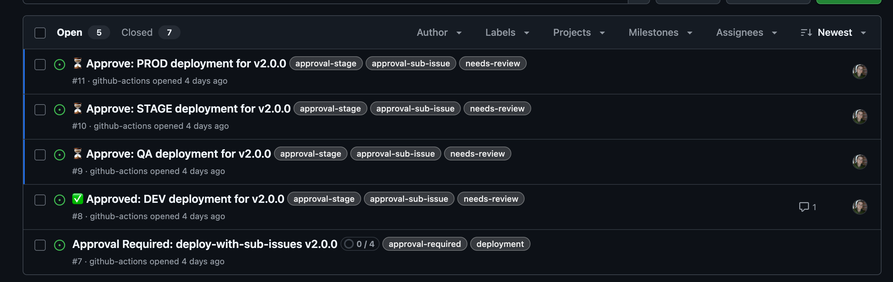
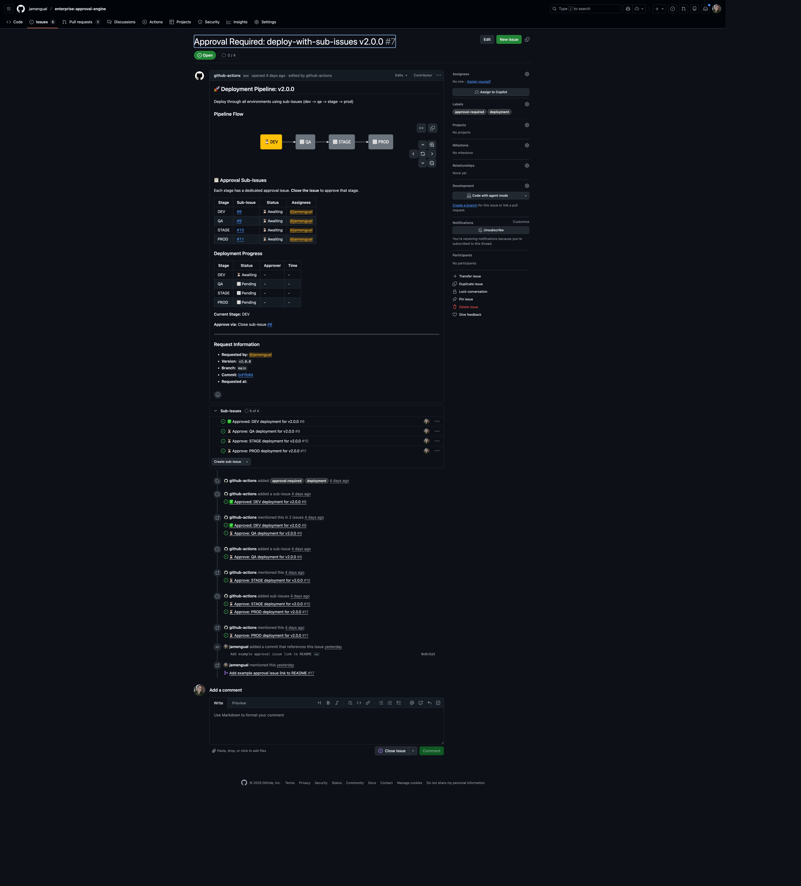

# Enterprise Approval Engine

[](README.md)
[](ES/README.md)

An **IssueOps-powered** GitHub Action for enterprise-grade approval workflows. Approvers comment `approve` or `deny` on GitHub Issues, and the action handles policy validation, tag creation, and deployment triggers.

> **What is IssueOps?** IssueOps uses GitHub Issues as the interface for operations. Instead of approving through a separate UI, approvers interact directly with issues—providing a transparent audit trail, familiar UX, and native GitHub notifications.

## IssueOps in Action

<table>
<tr>
<td width="50%">

**Issues list showing approval pipeline:**



</td>
<td width="50%">

**Approval issue with sub-issues and pipeline visualization:**



</td>
</tr>
</table>

[See a live example](https://github.com/jamengual/enterprise-approval-engine/issues/7)

## Quick Start

### 1. Create Configuration

Create `.github/approvals.yml`:

```yaml
version: 1

policies:
  dev-team:
    approvers: [alice, bob, charlie]
    min_approvals: 2

workflows:
  production-deploy:
    require:
      - policy: dev-team
    on_approved:
      create_tag: true
      close_issue: true
```

### 2. Request Approval Workflow

Create `.github/workflows/request-approval.yml`:

```yaml
name: Request Deployment Approval

on:
  workflow_dispatch:
    inputs:
      version:
        description: 'Version to deploy (e.g., v1.2.3)'
        required: true

jobs:
  request:
    runs-on: ubuntu-latest
    steps:
      - uses: actions/checkout@v4
      - uses: jamengual/enterprise-approval-engine@v1
        with:
          action: request
          workflow: production-deploy
          version: ${{ inputs.version }}
          token: ${{ secrets.GITHUB_TOKEN }}
```

### 3. Handle Approval Comments

Create `.github/workflows/handle-approval.yml`:

```yaml
name: Handle Approval Comments

on:
  issue_comment:
    types: [created]

jobs:
  process:
    if: contains(github.event.issue.labels.*.name, 'approval-required')
    runs-on: ubuntu-latest
    steps:
      - uses: actions/checkout@v4
      - uses: jamengual/enterprise-approval-engine@v1
        id: process
        with:
          action: process-comment
          issue_number: ${{ github.event.issue.number }}
          token: ${{ secrets.GITHUB_TOKEN }}

      - name: Trigger Deployment
        if: steps.process.outputs.status == 'approved'
        run: echo "Deploy ${{ steps.process.outputs.tag }}"
```

**That's it!** Trigger the workflow, then approve by commenting `approve` on the issue.

## Choose Your Pattern

| Need | Pattern | Setup Time | Documentation |
|------|---------|------------|---------------|
| Simple approval gate | Event-driven | 5 min | [Examples](docs/EXAMPLES.md#event-driven-pattern) |
| Wait for approval in workflow | Blocking | 5 min | [Examples](docs/EXAMPLES.md#blocking-pattern) |
| Multi-environment (dev→prod) | Pipeline | 10 min | [Pipelines](docs/PIPELINES.md) |
| Team-based policies | GitHub App | 15 min | [Team Support](docs/TEAM_SUPPORT.md) |
| Jira issue tracking | Jira integration | 10 min | [Jira](docs/JIRA_INTEGRATION.md) |

## Features

- **Flexible Approval Logic**: AND (all must approve) and threshold (X of N) within groups
- **OR Logic Between Groups**: Multiple approval paths—any group meeting requirements approves
- **Mixed Approvers**: Combine individual users and GitHub teams
- **Progressive Pipelines**: Track deployments through dev → qa → stage → prod
- **Sub-Issue Approvals**: Create dedicated sub-issues per stage
- **Jira Integration**: Extract issues from commits, update Fix Versions
- **Deployment Tracking**: Create GitHub deployments for visibility
- **External Config**: Centralize policies in a shared repository
- **GitHub Enterprise Server**: Full GHES support

## Action Reference

### Inputs

| Input | Description | Required | Default |
|-------|-------------|----------|---------|
| `action` | Operation: `request`, `check`, `process-comment`, `close-issue` | Yes | - |
| `workflow` | Workflow name from config | For `request` | - |
| `version` | Semver version for tag creation | No | - |
| `issue_number` | Issue number to process | For check/process/close | - |
| `token` | GitHub token | Yes | - |
| `config_path` | Path to approvals.yml | No | `.github/approvals.yml` |
| `config_repo` | External config repository | No | - |
| `wait` | Poll until approved/denied | No | `false` |
| `timeout` | Max wait time (e.g., `24h`) | No | `72h` |

See [Configuration Reference](docs/CONFIGURATION.md) for all options including Jira, deployment tracking, and team support inputs.

### Outputs

| Output | Description | Available For |
|--------|-------------|---------------|
| `status` | `pending`, `approved`, `denied`, `timeout` | All actions |
| `issue_number` | Issue number | All actions |
| `issue_url` | URL to the issue | All actions |
| `approvers` | Comma-separated approvers | `process-comment`, `check` |
| `tag` | Created tag name | `process-comment` (on approval) |
| `satisfied_group` | Group that satisfied approval | `process-comment`, `check` |

## Configuration

### Minimal Configuration

```yaml
version: 1

policies:
  approvers:
    approvers: [alice, bob]
    min_approvals: 1

workflows:
  deploy:
    require:
      - policy: approvers
    on_approved:
      create_tag: true
      close_issue: true
```

### Policies with OR Logic

Multiple groups with OR logic—any group meeting its threshold approves:

```yaml
policies:
  dev-team:
    approvers: [alice, bob, charlie]
    min_approvals: 2

  security:
    approvers: [team:security]
    min_approvals: 1

workflows:
  production:
    require:
      - policy: dev-team      # 2 of 3 developers
      - policy: security      # OR 1 security team member
```

### Multi-Stage Pipeline

```yaml
workflows:
  deploy:
    pipeline:
      stages:
        - name: dev
          policy: developers
          auto_approve: true
        - name: staging
          policy: qa-team
        - name: prod
          policy: production-approvers
          create_tag: true
          is_final: true
```

See [Configuration Reference](docs/CONFIGURATION.md) for complete options.

## Approval Keywords

**Approve:** `approve`, `approved`, `lgtm`, `yes`, `/approve`

**Deny:** `deny`, `denied`, `reject`, `rejected`, `no`, `/deny`

## Permissions

```yaml
permissions:
  contents: write      # Tag creation
  issues: write        # Issue management
  pull-requests: read  # PR tracking (pipelines)
  deployments: write   # Deployment tracking (optional)
```

For team-based approvals, use a [GitHub App token](docs/TEAM_SUPPORT.md).

## Common Issues

| Problem | Solution |
|---------|----------|
| Issue not created | Check `issues: write` permission and config path |
| Approval not recognized | Verify issue has `approval-required` label |
| Team membership not working | Use [GitHub App token](docs/TEAM_SUPPORT.md) |
| Tag creation failed | Check `contents: write` and version format |

See [Troubleshooting](docs/TROUBLESHOOTING.md) for detailed solutions.

## Documentation

| Topic | Description |
|-------|-------------|
| [Configuration Reference](docs/CONFIGURATION.md) | Complete config options, policies, workflows |
| [Multi-Stage Pipelines](docs/PIPELINES.md) | Progressive deployments, approval modes |
| [Workflow Examples](docs/EXAMPLES.md) | Copy-paste-ready workflow files |
| [Team Support](docs/TEAM_SUPPORT.md) | GitHub App setup for team approvals |
| [Jira Integration](docs/JIRA_INTEGRATION.md) | Issue extraction and Fix Version updates |
| [Troubleshooting](docs/TROUBLESHOOTING.md) | Common issues and solutions |

## GitHub Enterprise Server

The action automatically detects GHES using `GITHUB_SERVER_URL` and `GITHUB_API_URL`. No additional configuration required.

Rate limiting is handled with automatic retry (exponential backoff, max 5 retries).

## License

MIT License
